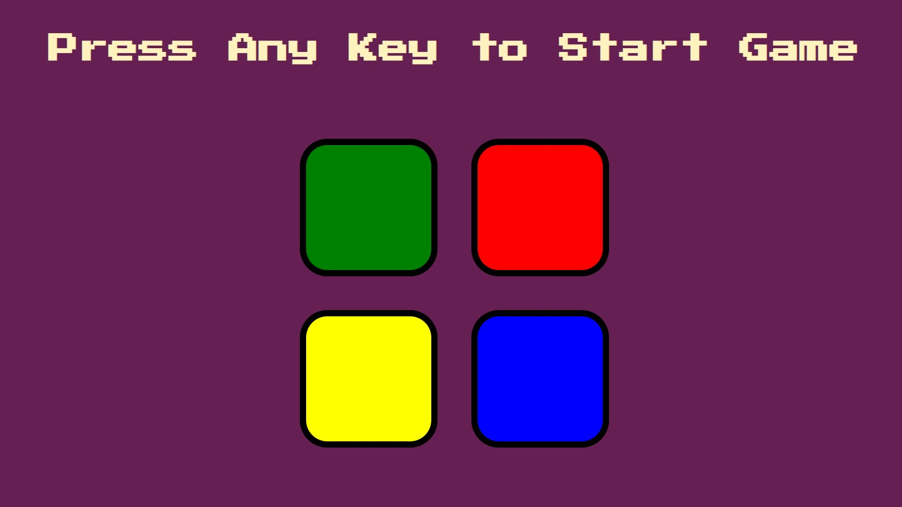

# Simon-Game
Simon Game made using HTML, CSS &amp; JavaScript.

Simon GameA classic pattern-memorization game built purely with frontend web technologies. Players must listen to and watch a randomly generated sequence of colors, then replicate it exactly. The sequence grows progressively longer with each successful round to challenge the player's short-term memory.

✨ FeaturesDynamic Sequence Generation: Randomly generates game patterns using an unpredictable color selector.

Progressive Difficulty: Extends the existing color sequence by one new random step each time you successfully clear a round.

Instant Validation: Monitors user clicks in real-time and immediately detects incorrect sequences.

Audio-Visual Feedback: Triggers distinct sound effects and flash animations for both button presses and game-over states.

Responsive Layout: Adapts cleanly to desktops, tablets, and mobile browser viewports.

🛠️ Tech StackHTML5: Structures the interactive game board and structural elements.

CSS3: Handles custom styling, grid-based button placement, and transition animations.

JavaScript (ES6): Controls game states, array-based sequence logic, event listeners, and DOM updates.

🕹️ How to Play

Press any key on your keyboard to start the game.

Watch the initial color flash and listen to its associated sound.

Click the matching color button to repeat the pattern.If correct, the game adds one more random color to the sequence.

Repeat the full sequence from memory in the exact order it was presented.

A single wrong click triggers a "Game Over" screen, requiring a keypress to reset and try again.

🚀 Live DemoView : https://tejasds13.github.io/Simon-Game/
